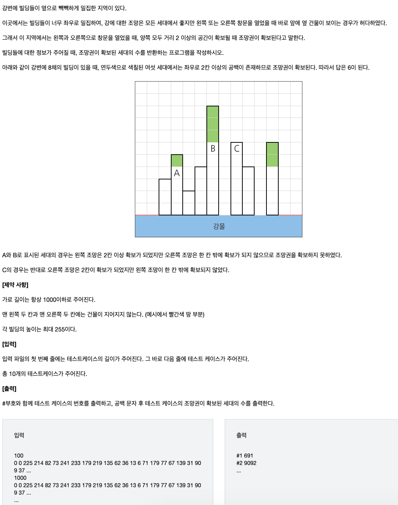

# 0209 SWEA_D3_1206_View

## 문제


## 풀이

- int 배열 사용
- 좌 2 우 2 검사하여 현재 위치의 높이가 가장 높으면 조망권 확보가 된 것이다.
- 좌2 우2 중에 가장 큰 값을 구해서 저장한다.
- 현재 요소가 그 값보다 크다면 sum 변수에 추가

    ❓처음에서 두 요소와 마지막에서 두 요소 검사 (인덱스 범위 벗어남)의 경우 건물이 지어지지 않아 0으로 들어오기 때문에 신경쓰지 않아도 됨

```java
for i in HEIGH = 2 to HEIGH.length
	max <- max value from HEIGH[i-2] to HEIGH[i+2]
	if HEIGH[i] > max
	then sum <- sum + HEIGH[i]-max
```
